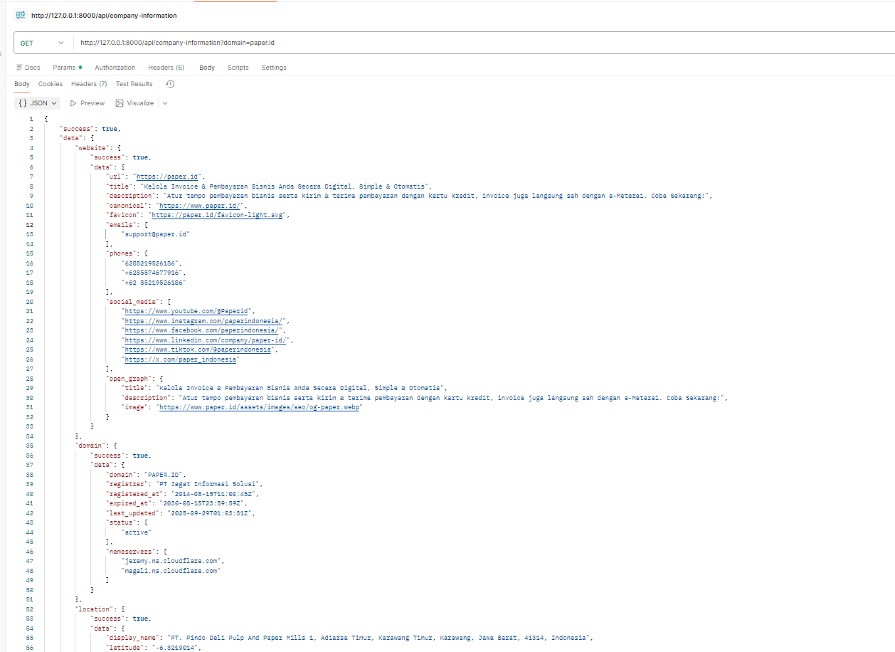
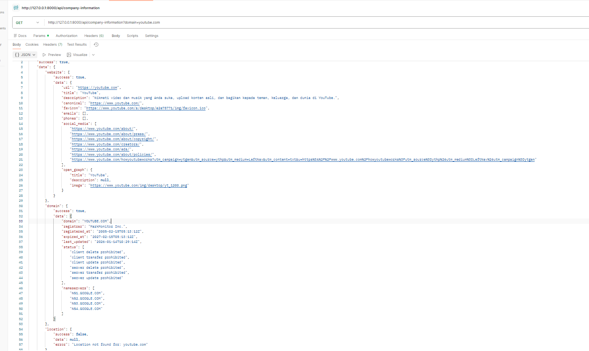

# Data Acquisition Engine

REST API sederhana pakai Laravel buat ngumpulin info perusahaan dari 3 sumber: metadata website, data domain (RDAP), dan lokasi (OpenStreetMap). Dibuat untuk Technical Challenge PKL di Berani Digital ID.

## Struktur Project

Saya pakai pola Service Layer, jadi logic-nya dipisah dari Controller. Alasannya biar tiap connector bisa di test sendiri-sendiri tanpa harus lewat HTTP request dulu (saya test semua Service pakai `php artisan tinker` sebelum bikin endpoint-nya).

```
app/
├── Http/Controllers/Api/
│   ├── WebsiteController.php
│   ├── DomainController.php
│   ├── LocationController.php
│   └── CompanyInformationController.php
├── Services/
│   ├── Contracts/
│   │   └── ExtractorInterface.php
│   ├── Extractors/
│   │   ├── WebsiteService.php
│   │   ├── DomainService.php
│   │   └── LocationService.php
│   └── CompanyInformationService.php
```

`ExtractorInterface` itu contract yang bikin semua connector punya method `extract()` yang sama, jadi kalau nanti mau nambah connector baru tinggal ikutin pola yang sama.

Untuk endpoint integrasi (`/company-information`), saya pakai pendekatan partial failure — kalau salah satu connector gagal (misal website-nya down), yang lain tetap jalan dan hasilnya tetap ditampilkan. Jadi tiap bagian response punya status `success` sendiri-sendiri.

## Architecture

Alur request-nya kira-kira begini:

```
Client
  │
  ▼
Controller (Http/Controllers/Api)
  │  - validasi input request
  │  - panggil Service yang sesuai
  ▼
Service (Services/Extractors atau CompanyInformationService)
  │  - cek cache dulu
  │  - kalau miss, panggil API eksternal (RDAP/Nominatim/target website)
  │  - transform response mentah ke struktur output yang konsisten
  │  - simpan ke cache & tulis log
  ▼
Response JSON
```

Tiga hal yang jadi pertimbangan utama pas desain:

1. **Controller cuma jadi jembatan HTTP.** Semua logic ekstraksi/transformasi ada di Service, jadi Controller tetep tipis dan gampang dibaca — cuma validasi input, panggil Service, return response.
2. **Contract (`ExtractorInterface`) menyeragamkan cara pakai tiap connector.** `CompanyInformationService` nggak perlu tau detail implementasi tiap Service, cukup panggil `extract()`.
3. **Partial failure di level agregasi.** `CompanyInformationService::safeExtract()` bungkus tiap panggilan connector, jadi satu connector gagal nggak bikin seluruh request `/company-information` ikut gagal.

## Yang dibutuhkan

- PHP 8.4+
- Composer 2.x
- Extension PHP: `pdo_sqlite`, `sqlite3`, `curl`, `openssl`

## Cara install

```bash
git clone https://github.com/florensia14/data-acquisition-engine.git
cd data-acquisition-engine
composer install
```

Salin file environment:
```bash
# Windows (PowerShell)
copy .env.example .env

# Linux/Mac
cp .env.example .env
```

```bash
php artisan key:generate
```

Bikin file database SQLite:
```bash
# Windows (PowerShell)
New-Item -ItemType File -Path database\database.sqlite -Force

# Linux/Mac
touch database/database.sqlite
```

Jalankan migration:
```bash
php artisan migrate
```

## Konfigurasi

Database pakai SQLite, tapi cuma buat kebutuhan internal Laravel (session, cache, queue), bukan buat nyimpen data hasil scraping. Setting default di `.env` udah pas:

```env
DB_CONNECTION=sqlite
SESSION_DRIVER=database
CACHE_STORE=database
QUEUE_CONNECTION=database
```

`CACHE_STORE=database` ini penting karena ketiga Service (`WebsiteService`, `DomainService`, `LocationService`) sekarang pakai `Cache::` facade buat nyimpen hasil extract sementara, dan drivernya ngikutin config ini.

Nggak ada API key yang dibutuhin karena RDAP dan Nominatim itu public API, nggak perlu auth.

**Kalau pakai Windows** dan kena error `SSL certificate problem` waktu request ke luar, ini karena PHP di Windows nggak otomatis punya sertifikat CA. Solusinya download [cacert.pem](https://curl.se/ca/cacert.pem), terus di `php.ini` tambahin:

```ini
curl.cainfo = "C:\path\ke\cacert.pem"
openssl.cafile = "C:\path\ke\cacert.pem"
```

Ini kendala yang saya alami sendiri pas development di laptop Windows, jadi saya masukin ke sini biar yang mau jalanin di Windows juga nggak stuck lama kayak saya kemarin.

## Jalanin aplikasinya

```bash
php artisan serve
```

Nanti jalan di `http://127.0.0.1:8000`

## Endpoint

Base URL: `http://127.0.0.1:8000/api`

### POST /extract/website

Ambil metadata dari sebuah website.

Body:
```json
{
  "url": "https://paper.id"
}
```

Response kalau berhasil:
```json
{
  "success": true,
  "data": {
    "url": "https://paper.id",
    "title": "Kelola Invoice & Pembayaran Bisnis Anda Secara Digital, Simple & Otomatis",
    "description": "...",
    "canonical": "https://www.paper.id/",
    "favicon": "https://paper.id/favicon-light.svg",
    "emails": ["support@paper.id"],
    "phones": ["6285219526186"],
    "social_media": ["https://www.instagram.com/paperindonesia/"],
    "open_graph": {
      "title": "...",
      "description": "...",
      "image": "..."
    }
  }
}
```

Response kalau gagal:
```json
{
  "success": false,
  "message": "Failed to extract website metadata",
  "error": "cURL error 6: Could not resolve host: ..."
}
```

### POST /extract/domain

Ambil data registrasi domain lewat RDAP.

Body:
```json
{
  "domain": "paper.id"
}
```

Response kalau berhasil:
```json
{
  "success": true,
  "data": {
    "domain": "PAPER.ID",
    "registrar": "PT Jagat Informasi Solusi",
    "registered_at": "2014-08-15T11:00:45Z",
    "expired_at": "2030-08-15T23:59:59Z",
    "last_updated": "2025-09-29T01:03:31Z",
    "status": ["active"],
    "nameservers": ["jeremy.ns.cloudflare.com", "magali.ns.cloudflare.com"]
  }
}
```

Response kalau gagal (domain nggak ketemu):
```json
{
  "success": false,
  "message": "Failed to extract domain information",
  "error": "Domain not found or invalid: domain-tidak-ada.com"
}
```

### POST /extract/location

Cari lokasi perusahaan pakai Nominatim.

Body:
```json
{
  "query": "PT Telkom Indonesia"
}
```

Response kalau berhasil:
```json
{
  "success": true,
  "data": {
    "display_name": "PT Telkom Indonesia, Jalan Gelong Baru Utara, ...",
    "latitude": "-6.1751004",
    "longitude": "106.7932787",
    "importance": 0.0000831,
    "osm_type": "way",
    "address": {
      "road": "Jalan Gelong Baru Utara",
      "city": "Jakarta Barat",
      "postcode": "11440",
      "country": "Indonesia"
    }
  }
}
```

Response kalau gagal:
```json
{
  "success": false,
  "message": "Failed to extract location information",
  "error": "Location not found for: query-tidak-jelas"
}
```

### GET /company-information?domain=paper.id

Endpoint integrasi, gabungin hasil dari 3 connector di atas.

Response:
```json
{
  "success": true,
  "data": {
    "website": {
      "success": true,
      "data": { "...": "..." }
    },
    "domain": {
      "success": true,
      "data": { "...": "..." }
    },
    "location": {
      "success": true,
      "data": { "...": "..." }
    }
  }
}
```

Kalau salah satu gagal, bagian itu aja yang nunjukin error, yang lain tetap tampil normal:
```json
"location": {
  "success": false,
  "data": null,
  "error": "Location not found for: nama-yang-tidak-ditemukan"
}
```

## Logging & Caching

Sebagai nilai tambah, saya tambahin logging dan caching di tiga Service (`WebsiteService`, `DomainService`, `LocationService`).

**Caching**
- Tiap Service ngecek cache dulu sebelum manggil API eksternal, pakai key `{tipe}:{md5(input)}` (contoh: `domain:5d41402abc4b2a76b9719d911017c592`).
- TTL cache di-set 3600 detik (1 jam), disimpen di konstanta `CACHE_TTL` masing-masing Service.
- Tujuannya ngurangin request berulang ke RDAP/Nominatim/website target buat input yang sama, sekaligus lebih responsif kalau data udah pernah diambil sebelumnya.
- Cache cuma nyimpen hasil yang sukses; kalau extract gagal, exception langsung dilempar dan nggak ikut di-cache.

**Logging**
- Semua Service nyatet log di titik-titik penting: mulai fetch, cache hit, sukses extract, dan gagal extract (pakai level `info` dan `error`).
- Log ditulis lewat facade `Log::` bawaan Laravel, jadi ikut config default di `config/logging.php` — defaultnya kesimpen di `storage/logs/laravel.log`.
- Context yang disertain di tiap log (misal `domain`, `url`, atau `query`) biar gampang di-trace kalau ada error dari API eksternal.
- Di `CompanyInformationService`, ada log tambahan pas mulai dan selesai agregasi, termasuk status sukses/gagal dari tiap connector.

## Asumsi & kendala yang saya temuin

**Soal pencarian lokasi di endpoint integrasi** ini yang paling tricky. Endpoint `/company-information` cuma nerima parameter `domain`, tapi Nominatim itu butuh nama entitas buat nyari lokasi yang akurat, bukan domain. Jadi saya pakai nama registrar dari hasil RDAP dulu buat query lokasi, kalau itu gagal baru fallback pakai nama domainnya langsung.

Masalahnya, ini nggak selalu akurat. Registrar itu perusahaan penyedia jasa domain, bukan berarti itu alamat kantor asli si pemilik domain. Dan kalau fallback ke nama domain, kadang hasilnya ngaco — contohnya waktu saya test pakai `paper.id`, fallback-nya malah nemu "Paper Mills" (pabrik kertas) karena sama-sama ada kata "paper". Ini keterbatasan yang saya sadari, tapi belum ketemu cara yang lebih baik dalam waktu pengerjaan yang ada.

**Ketergantungan ke API luar** — ketiga connector semuanya manggil layanan eksternal yang saya nggak bisa kontrol. Kalau website target down, domain nggak kedaftar, atau nama nggak ketemu di Nominatim, ya otomatis gagal. Saya coba tangani semua ini biar responnya tetap konsisten (JSON rapi, bukan error 500 mentah).

**Nominatim wajib User-Agent** — awalnya saya nggak tau ini, requestnya ditolak. Ternyata Nominatim emang mewajibkan header User-Agent di setiap request sebagai bagian dari kebijakan mereka. Udah saya tambahin di `LocationService`.

**Cache yang stale** — karena TTL-nya 1 jam, ada kemungkinan data yang ditampilin nggak 100% real-time (misal domain baru aja diperpanjang, tapi cache masih nunjukin data lama sampai TTL habis). Ini trade-off yang saya ambil demi ngurangin beban ke API eksternal, dan menurut saya wajar buat kasus penggunaan kayak gini.

**Kendala SSL di Windows** udah saya jelasin di bagian konfigurasi di atas, ini yang paling lama saya debug pas awal-awal development.

## Future Improvements

Beberapa hal yang kalau ada waktu lebih pengen saya lanjutin:

- **Perbaikan strategi pencarian lokasi** — daripada cuma fallback registrar → domain, idealnya nyari nama entitas asli si pemilik domain dari data RDAP (kalau tersedia) atau kombinasi sinyal lain, biar hasil Nominatim lebih akurat dan nggak salah nangkep kayak kasus "Paper Mills".
- **Unit test & feature test** — sejauh ini saya baru test manual pakai `tinker` dan Postman, belum sempat nulis test otomatis buat tiap Service dan endpoint.
- **Rate limiting** — biar nggak nge-spam API eksternal (terutama Nominatim yang punya usage policy ketat) kalau endpoint dipanggil berkali-kali dalam waktu singkat.
- **Validasi & proteksi SSRF di `/extract/website`** — mem-batasi scheme URL (http/https aja) dan nge-block IP private/loopback biar endpoint ini nggak bisa disalahgunakan buat probe jaringan internal server.
- **Dockerize** — biar setup-nya nggak bergantung ke environment PHP lokal (termasuk masalah SSL di Windows yang saya alamin sendiri).
- **Dokumentasi OpenAPI/Swagger** — biar endpoint-nya bisa dicoba langsung dari browser tanpa perlu Postman.

## Screenshot

### Challenge 1 - Website Metadata Extractor

| Paper.id | YouTube |
|----------|---------|
| .jpeg) | .jpeg) |

### Challenge 2 - Domain Intelligence

| Paper.id | Tokopedia |
|----------|------------|
| .jpeg) | .jpeg) |

### Challenge 3 - Company Location Finder

| PT Telkom Indonesia | Bank Central Asia |
|---------------------|-------------------|
| .jpeg) | .jpeg) |

### Final Integration

| Paper.id | YouTube |
|----------|---------|
|  |  |

### Application Logs (Logging & Cache)

Berikut contoh log aplikasi yang menunjukkan proses request, proses ekstraksi data, dan cache hit yang ditulis ke `storage/logs/laravel.log`.

.jpeg)

## Video Presentasi

Link video presentasi (YouTube, unlisted): `<tempel link di sini>`

## Teknologi

- Laravel 13
- Symfony DomCrawler (buat parsing HTML metadata website)
- SQLite (buat session/cache/queue bawaan Laravel)
- Laravel Cache (database driver) buat caching hasil extract
- Laravel Log buat logging proses & error